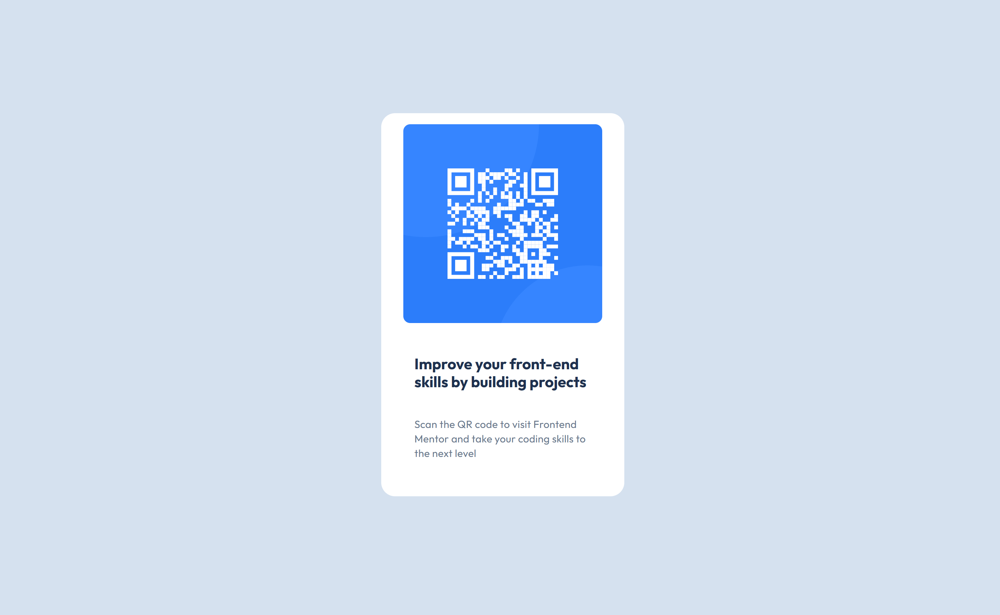

# 🖥️ Frontend Mentor - QR code component solution

This is a solution to the [QR code component challenge on Frontend Mentor](https://www.frontendmentor.io/challenges/qr-code-component-iux_sIO_H).  
Frontend Mentor challenges help you improve your coding skills by building realistic projects.

## 📁 Table of contents

- [Overview 🔎](#overview-)
- [Screenshot 📸](#screenshot-)
- [Links 🔗](#links-)
- [Built with 🛠️](#built-with-)
- [What I learned 🧠](#what-i-learned-)

## 🔎 Overview

The QR code component challenge is a beginner-level project focused on building a simple, responsive card that displays a QR code and some text. The main goal is to practice structuring HTML, applying CSS for layout and styling, and ensuring the component looks great on all devices. This project is a great way to reinforce core front-end skills and attention to design details.

## 📸 Screenshot

## 🔗 Links

- [Solution on Frontend Mentor](https://www.frontendmentor.io/solutions/your-solution-url)
- [Live Site](https://your-live-site-url.com)

## 🛠️ Built with

- Semantic HTML5 markup
- CSS custom properties
- Flexbox

## 🧠 What I learned

During this project, I gained hands-on experience with several essential front-end development skills:

- 🏗️ **Structuring HTML**  
  Learned to build a clean, semantic HTML page for better accessibility and clarity.

- 🎯 **Centering with Flexbox**  
  Mastered CSS Flexbox to perfectly center content both vertically and horizontally.

- ✍️ **Using Custom Fonts**  
  Integrated Google Fonts and applied them in CSS for a polished, modern look.

- 🎨 **Component Styling**  
  Practiced styling with border-radius, padding, gap, and background colors to closely match a given design.

- 📱 **Responsive Design**  
  Made the component look great on all devices by using relative units and considering different screen sizes.

- 📁 **Project Organization**  
  Organized files (HTML, CSS, images) and maintained a tidy repository with a proper `.gitignore`.

- 📝 **Following a Style Guide**  
  Translated design specs—colors, typography, spacing—into accurate, maintainable code.

- 🖼️ **Accessible Images**  
  Used descriptive alt text for images to improve accessibility for all users.

- ⚡ **Image Optimization**  
  Optimized and referenced images correctly in HTML for faster load times and better performance.